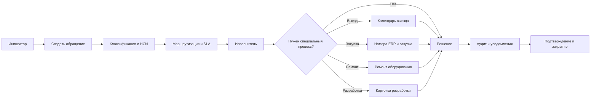

# Целевое описание бизнес-процессов Service Desk

Статус: целевая модель TO-BE  
Версия: 1.0  
Дата: 08.09.2026

## 1. Целевая модель

Service Desk является единой точкой входа для обращений сотрудников и владельцев ИТ-сервисов. Все операции выполняются через документы и справочники, права проверяются на каждом API-методе, а межсервисные изменения передаются событиями.

## 2. Сквозной процесс обращения

### 2.1. Регистрация

Инициатор создает документ через веб-форму, диспетчер регистрирует обращение от имени пользователя или обращение поступает через интеграцию. Система присваивает номер и код, фиксирует дату, автора и снимок основных данных пользователя: ФИО, email, организация и подразделение.

### 2.2. Классификация

Выбираются тип и вид заявки, система и при необходимости оборудование. Справочники используются для выбора и правил маршрутизации, но документ хранит собственные значения, чтобы история обращения не зависела от последующего изменения НСИ.

### 2.3. Маршрутизация

Правила проверяются по приоритету и условиям: типу, виду, системе, организации, подразделению, компетенциям, территории и оборудованию. Результат — группа поддержки, исполнитель, приоритет и SLA. Если исполнитель не найден, документ остается в очереди, а диспетчеру показывается причина.

### 2.4. Исполнение

Исполнитель ведет работу в карточке документа, добавляет комментарии, меняет статус и фиксирует результат. При выезде создается параметр визита с календарной датой и временем. При закупке ведется список номеров ERP; каждое новое значение добавляет системный комментарий.

### 2.5. Специализированные ветви

- **Ремонт:** для вида «Ремонт» или «Запрос на обслуживание» выбирается оборудование; флаг «Ремонт» переводит документ в статус «В ремонте».
- **Разработка:** флаг «Требуется разработка» создает дочернюю карточку в доске выбранной системы. Доска доступна, если ее статус — «Ведется разработка функционала». Жизненный цикл: Backlog → Аналитика → Разработка → Документация → Тестирование → Готово к релизу → Выпущено в релиз.
- **ТМЦ:** поступление и движение оформляются отдельными документами. Выдача «Нового» оборудования меняет его состояние на «Выдано».
- **Согласование:** если установлен флаг «Требует согласования», выбирается согласующий, а завершение документа допускается только после его решения.

### 2.6. Решение и закрытие

Исполнитель указывает результат, инициатор получает уведомление и может подтвердить решение. После подтверждения документ переводится в «Решено», затем в «Закрыто» согласно регламенту. Все переходы, комментарии, назначения и нарушения SLA записываются в аудит.

## 3. Процесс разработки

Карточка обращения — корневой документ. Карточка разработки — дочерний документ, который наследует связь с обращением и системой, но имеет собственные статусы, исполнителей, сроки, часы, комментарии, наблюдателей, подзадачи и историю.

Роли процесса: диспетчер регистрирует потребность, аналитик уточняет требования, разработчик выполняет работу, тестировщик подтверждает результат, владелец системы принимает релиз. Выход процесса — версия функционала и ссылка на релиз, после чего исходное обращение получает результат.

## 4. Процесс управления активами и ТМЦ

1. Администратор или ответственный ведет номенклатуру и склады.
2. Ответственный оформляет поступление ТМЦ отдельным документом.
3. Складской остаток увеличивается после проведения.
4. При выдаче оформляется движение оборудования с организацией, подразделением, получателем и выдавшим сотрудником.
5. Для нового оборудования автоматически устанавливается состояние «Выдано».
6. Возврат, ремонт, замена и списание проходят отдельными движениями с обязательным аудитом.
7. Остатки, серийные номера, признак Б/У и комментарии доступны отчетам и интеграции ERP.

## 5. Процесс видеокамер и ИБ

Оператор работает со сменами и фиксирует нарушение. Старший оператор формирует расписание и принимает рекомендации. Фото хранится в файловом сервисе, а в документе остается метадата и защищенная ссылка.

Событие ИБ поступает из интерфейса или webhook, классифицируется, получает ответственного и приоритет, затем проходит расследование, комментарии, вложения и закрытие. Доступ ограничен ролями, каждое действие попадает в audit service.

## 6. НСИ и управление доступом

Администратор поддерживает пользователей, роли, права, системы, виды заявок, группы поддержки, SLA, организации, подразделения, оборудование, склады и интеграции. Изменение НСИ не должно обходить API-проверки и должно фиксироваться в аудите.

Проверка доступа выполняется по принципу deny by default. Инициатор видит свои документы, исполнитель — назначенные, диспетчер — очередь и разрешенные области, руководитель — документы на согласование, администратор — НСИ и системные настройки.

## 7. Интеграции и события

API Gateway принимает запрос, добавляет request/correlation ID и передает его владельцу домена. Сервис-владелец сохраняет данные и outbox-событие в одной транзакции. Relay публикует событие в RabbitMQ; потребители обновляют уведомления, аудит, аналитику и проекции без SQL JOIN между сервисными БД.

Основные события: создание/изменение обращения, смена статуса, назначение, комментарий, создание карточки разработки, движение оборудования, поступление ТМЦ, нарушение камеры, событие ИБ, отправка уведомления.

## 8. Отчетность и показатели

Целевые отчеты строятся на событиях и фактах Analytics Service. Минимальные KPI:

- количество обращений по статусам, типам, системам и подразделениям;
- время до назначения и решения;
- доля нарушений SLA;
- нагрузка групп и исполнителей;
- длительность разработки и задержка релиза;
- остатки ТМЦ и оборот оборудования;
- количество нарушений камер и инцидентов ИБ;
- доля обращений, закрытых с первого решения.

Пользователь открывает детализацию отчета и переходит непосредственно к документу обращения или карточке разработки.

## 9. Исключения и контрольные точки

| Ситуация | Целевое поведение |
| --- | --- |
| Нет исполнителя | Очередь диспетчера, причина и уведомление |
| Нарушение SLA | Эскалация ответственному и запись в аналитику |
| Нет остатка ТМЦ | Запрет проведения выдачи, предложение закупки |
| Нет согласования | Документ не завершается |
| Недоступна внешняя ИС | Retry/idempotency, outbox сохраняется |
| Неверное вложение | Отклонение до записи, причина пользователю |
| Недостаточно прав | 403, без раскрытия лишних данных, запись отказа в аудите |
| Ошибка файла | Документ сохраняется без битого вложения, повторная загрузка доступна |

## 10. Владельцы процессов

| Процесс | Владелец | Результат |
| --- | --- | --- |
| Прием и исполнение обращений | Владелец Service Desk | закрытое обращение |
| Маршрутизация и SLA | Руководитель поддержки | назначение и контроль сроков |
| Разработка | Владелец разработки | выпущенный релиз |
| НСИ и доступ | Администратор | актуальные справочники и права |
| Активы и ТМЦ | Материально ответственное лицо | подтвержденные остатки и движения |
| Камеры | Старший оператор | расписание и обработанные нарушения |
| ИБ | Владелец ИБ | расследованное событие |
| Аналитика | Владелец отчетности | показатели и детализация |

## 11. Граница целевого контура

На переходный период legacy API может обслуживать текущий интерфейс, а новые сервисы уже владеют своими доменами. Целевое состояние наступает после перевода frontend на `/api/v1`, проверки событий и миграции данных; затем legacy-контур выводится из эксплуатации по отдельному плану.
