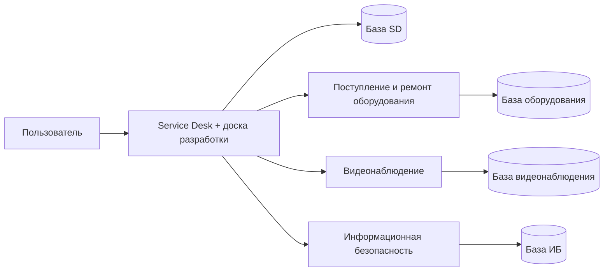

# Service Desk и подключаемые сервисы

Актуальная реализация — `src/main.ts`, `src/plugins/*.main.ts` и `compose.standalone.yml`.
Обращения и доска разработки остаются в ядре. Три дополнительных приложения запускаются отдельными процессами, используют отдельные базы PostgreSQL и управляются в **Настройки → Подключаемые блоки**.

| Приложение | Ответственность | API через SD | База |
|---|---|---|---|
| Ядро SD | Вход, пользователи, права, обращения, разработка, маршрутизация, подключения интеграций | `/auth`, `/tickets`, `/admin`, `/integrations`, `/modules` | `service_desk` |
| Поступление и ремонт оборудования | Оборудование, склады, остатки, поступления, движения, журнал ремонтов | `/assets` | `equipment` |
| Видеонаблюдение | График операторов, нарушения, вложения, тикеты по камерам | `/cameras` | `surveillance` |
| Информационная безопасность | Инциденты, доступы, уязвимости, риски и документы ИБ | `/security` | `security` |



## Переключение и границы доступа

Переключать сервисы может только администратор. Состояние хранится в `connected_services`, изменения записываются в аудит. Номер ревизии предотвращает потерю параллельных изменений настроек.

Отключение скрывает пункт меню и блокирует новые запросы к API сервиса, включая его таблицы НСИ. Уже выполняющийся запрос может завершиться. Данные, вложения и контейнеры сохраняются; включение возвращает доступ после проверки готовности базы сервиса. При первом переносе все три блока отключены: администратор включает нужные в настройках.

Браузер работает с единым адресом SD и серверной сессией. Ядро удаляет присланные клиентом заголовки роли и пользователя. Внутренние запросы подписаны отдельным ключом каждого сервиса: подпись связывает пользователя, роль, адрес, метод и тело запроса; срок действия — 30 секунд, повторное использование отклоняется. Порты сервисов и баз в Compose не публикуются наружу.

Сервисы получают через подписанный API локальную копию общих справочников пользователей, ролей, организаций и подразделений. Пароли и сессии не передаются. Справочники обновляются по запросу, не чаще одного раза в пять секунд. Бизнес-таблицы между базами не объединяются SQL-запросами. Связи с обращениями SD сохраняются как внешние идентификаторы.

Обращение хранит снимок названия и инвентарного номера оборудования. Поэтому старые обращения доступны при отключённом оборудовании. Создание обычного обращения не требует дополнительного сервиса; выбор оборудования и новые операции ремонта требуют включённого блока.

## Обновление существующей установки

Требуются Node.js 24, PostgreSQL 16 и Docker Compose с поддержкой `--wait`. Этот Compose использует существующую сеть Caddy `one-c-news_one-c-news` и каталог установки `/opt/servicedesk`. Для другой инфраструктуры настройте сеть и `PUBLIC_ORIGIN`.

1. Соберите backend и frontend: `npm run build`, затем `npm --prefix frontend run build`.
2. Остановите **все приложения, записывающие в исходную базу**. Сохраните согласованную резервную копию базы, старого приложения, `.env` и тома вложений. Старый монолит нельзя запускать одновременно с переносом.
3. Оставьте прежний `DB_PASSWORD`. Добавьте в серверный `.env` случайные независимые `EQUIPMENT_DB_PASSWORD`, `SURVEILLANCE_DB_PASSWORD`, `SECURITY_DB_PASSWORD` и `EQUIPMENT_SECRET`, `SURVEILLANCE_SECRET`, `SECURITY_SECRET` (ключи не короче 32 символов; рекомендуется 32 случайных байта в hex). Не помещайте `.env` в Git.
4. Передайте новые исходники и собранные `dist`, `frontend/dist`. Соберите образы:

   ```sh
   docker compose -f compose.standalone.yml build app equipment surveillance security migrate-services migrate-files
   docker compose -f compose.standalone.yml up -d --wait db equipment-db surveillance-db security-db
   docker compose -f compose.standalone.yml run --rm migrate-services
   docker compose -f compose.standalone.yml run --rm migrate-files
   docker compose -f compose.standalone.yml up -d --wait app equipment surveillance security
   ```

5. Войдите существующей учётной записью администратора, откройте настройки, включите нужные блоки и проверьте рабочие сценарии.

Миграция сохраняет UUID, номера документов, последовательности и журнал аудита соответствующего домена. Проверяются количества строк. Оборудование со статусом ремонта получает запись в новом журнале. После успешного импорта всех трёх сервисов старые бизнес-таблицы перемещаются в схему `retired_services`; из рабочего ядра они больше не используются. Ограничения архивных таблиц на живые справочники SD снимаются.

Повторный запуск не перезаписывает заполненные сервисы. Отпечаток исходных бизнес-данных выявляет изменение источника после частичного переноса; при несовпадении требуется сверка данных. Не очищайте таблицы или отметки миграции для обхода этой проверки.

Вложения видеонаблюдения и ИБ копируются в отдельные постоянные тома, исходный том сохраняется. Проверяются наличие и размер файлов, права назначаются пользователю приложения. Ожидаются существующие Linux-пути `/app/storage/camera-violations/...` и `/app/storage/security/...`.

Для отката остановите новые приложения и восстановите **согласованный комплект** старой базы, файлов и приложения. Если после переноса уже были рабочие изменения в новых сервисах, сначала сохраните их и подготовьте обратный перенос: простое восстановление старой копии их потеряет.

## Проверка и текущий статус

- Проверка типов backend/frontend и 34 автоматических теста.
- `scripts/test-connected-services.cjs` проверяет четыре процесса на изолированной копии PostgreSQL: выключение/включение, НСИ, права, подписи, ремонт, тикеты камер и работу SD при остановленном оборудовании. Скрипт принимает только PostgreSQL на `localhost:55439`; не предназначен для рабочей базы.
- Проверены в браузере настройки, переключатели, изменение меню и загрузка оборудования.
- Новая архитектура пока не опубликована на рабочем сервере: SSH доступен только из разрешённого российского сегмента.

## Прежний архитектурный прототип

Каталоги `apps/api-gateway`, `services/*`, `packages/shared-kernel`, файл `docker-compose.deploy.yml` и прежние ADR сохранены как исторический прототип. Они не являются текущим способом развёртывания. В частности, не следует подменять ими шлюз с серверной авторизацией из `src/main.ts`.
