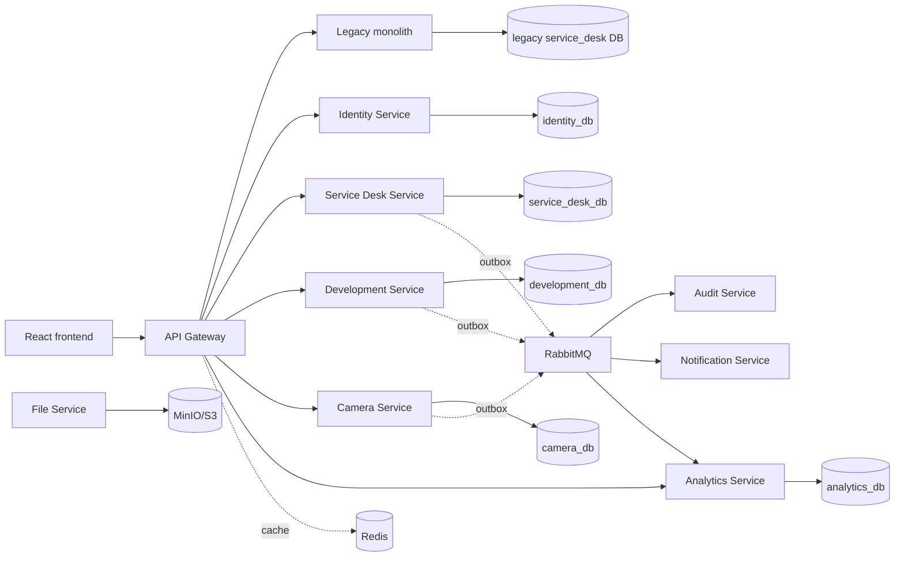

# DevControl: целевая микросервисная архитектура

## Архитектурный рефакторинг

До изменений проект был NestJS-монолитом: frontend и REST API обслуживались одним процессом, а `tickets`, `users`, камеры, НСИ, склад и разработка работали через один PostgreSQL connection pool. Это сохраняется как legacy-контур на время миграции, чтобы текущий frontend не ломался.

Новый контур добавлен по Strangler Fig: API Gateway является единой точкой входа, `/api/*` маршрутизируется в legacy-монолит, а `/api/v1/*` — в независимые сервисы.

## Владельцы данных

| Сервис | Собственные данные | Публичные способы связи |
| --- | --- | --- |
| Identity | пользователи, роли, права, подразделения, AD state | `/api/v1/identity`, `GET /internal/users/{id}`, события пользователя |
| Service Desk | обращения, SLA, наблюдатели, комментарии | `/api/v1/tickets`, `Ticket*` |
| Development | Kanban, карточки, подзадачи, work hours, `user_projection` | `/api/v1/development`, `DevelopmentTask*` |
| Camera | смены, нарушения, вложения metadata | `/api/v1/cameras`, `Camera*` |
| Analytics | dimensions, facts, cube runs, event log | `/api/v1/analytics` |
| Audit | immutable event audit | `/audit/events` |
| Notification | in-app/email/Telegram delivery state | `/notifications` |
| File | metadata and object keys | presigned S3/MinIO URLs |

Cross-service foreign keys и SQL JOIN запрещены. Внешние связи представлены UUID/business ID; имена пользователей реплицируются событием в `user_projection`.

## Cache and broker

Redis — только cache-aside/locks/rate-limit/idempotency, не источник истины. Namespaces и TTL задаются через environment: `identity:user:*` (10 минут), permissions (5 минут), dictionaries (30 минут), Kanban (1 минута), camera schedule (5 минут). Cache failure не блокирует чтение из БД.

RabbitMQ используется как durable topic exchange `service-desk.events`. Каждое важное изменение сначала пишет бизнес-данные и `outbox_events` в одной транзакции. `outbox-relay` публикует записи после commit; consumers используют `processed_events` либо уникальный `event_id`.

## Analytics / OLAP

Analytics Service не обращается к OLTP БД. События попадают в `analytics_event_log`, после чего bootstrap/incremental processing заполняет Star Schema: `fact_tickets`, `fact_development_tasks`, `fact_work_hours`, `fact_camera_shifts`, `fact_camera_violations`, `fact_sla` и измерения `dim_date`, `dim_user`, `dim_department`, `dim_organization`, `dim_ticket_type`, `dim_ticket_status`, `dim_development_status`, `dim_priority`, `dim_camera_object`. `dim_user`, подразделения и организации поддерживают SCD Type 2.

`POST /api/v1/analytics/cube/rebuild` строит полный набор дат и пересчитывает run из event log; `refresh` предназначен для incremental запуска. Дальнейшая замена PostgreSQL на ClickHouse скрыта за API Analytics Service.

## Безопасность и наблюдаемость

Gateway добавляет `X-Request-ID` и `X-Correlation-ID`, ограничивает размер тела и rate limit. Сервисы повторно проверяют роль на критичных endpoint-ах. Сервисные URL и credentials задаются только environment variables. Каждый сервис имеет `/health/live` и `/health/ready`, structured JSON logs и `/metrics` у gateway; для Prometheus/Grafana/Loki/OpenTelemetry подготовлены Compose-конфигурация и точки подключения.

## Миграционные этапы

1. Redis, RabbitMQ и outbox включены в инфраструктурный контур.
2. Analytics DB и event log работают отдельно от OLTP.
3. Новый Development Service принимает `/api/v1/development`, legacy `/api/tickets/development` сохраняется.
4. Аналогично переводятся Camera, Identity и Service Desk.
5. После перевода frontend на `/api/v1` legacy-контур выводится из эксплуатации.

Пока legacy API подключен к прежней БД для backward compatibility. Это единственный оставшийся архитектурный долг; новые сервисы не используют её таблицы.
